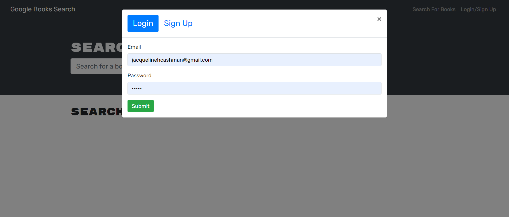

# Book Search Engine

# Description

This web application allows the user to search for books using a fully functioning Google Books API search engine built with GraphQL API and Apollo Server. It allows the user to search for books, save them to your personalized list and remove them. It also allows users to save book searches to the back end.

## Table of Contents 
* [Technologies Used](#technologies-used)
* [Installation](#installation)
* [Screenshots](#screenshots)
* [Links](#links)
* [Contributors](#contributors)

## Technologies Used

- MERN stack
- React frontend
- MongoDB database
- Node.js
- Express.js

## Installation

- git clone git@github.com:jacquelinehockin/Book_Search_Engine.git
- cd Book_Search_Engine
- npm install
- npm start

## Usage 

- npm run develop

## Screenshots

## Links

GitHub repository URL: 
https://github.com/JacquelineHockin/Book_Search_Engine

## Contributors 
- Jacqueline Cashman
- [GitHub: JacquelineHockin](https://github.com/jacquelinehockin)